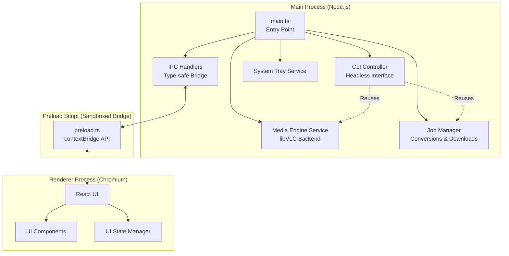
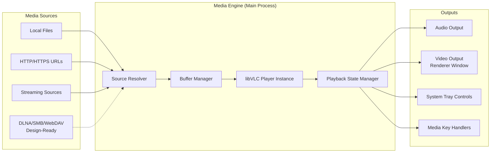
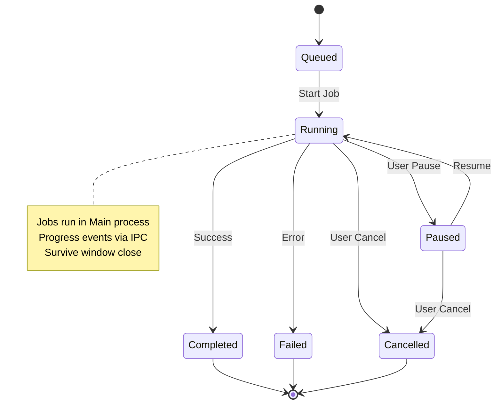
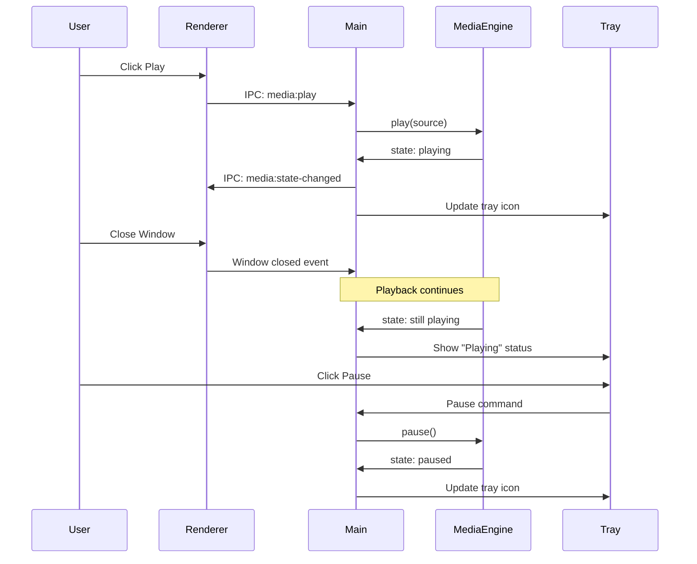

# Ginger Media Player - Architecture & Design Document

> [!IMPORTANT]
> This is a **design-only document**. No implementation code will be written until this architecture is reviewed and approved.

## Executive Summary

This document outlines the architecture for **Ginger Media Player**, a cross-platform Electron desktop application designed as a modern, secure, and maintainable alternative to VLC Media Player. The design prioritizes:

- **Background-capable playback** that survives window closure
- **CLI-first architecture** enabling headless operation and AI integration
- **Strict TypeScript** with zero `any` types
- **Security-first** Electron configuration with proper sandboxing
- **Modular, testable** architecture for long-term maintainability

---

## 1. Architecture Overview

### 1.1 Electron Process Separation



**Critical Design Principle:**
> The renderer UI **NEVER** owns playback state. All media playback, conversion jobs, and downloads live in the Main process and are controllable without any UI.

### 1.2 Media Pipeline Architecture



### 1.3 Background Job Execution Model



**Job Types:**
- **Media Conversion**: FFmpeg-based video→audio, format changes
- **Downloads**: yt-dlp integration for YouTube/online media
- **Future**: Batch operations, transcoding queues

---

## 2. Technology Tradeoffs & Decisions

### 2.1 Media Playback: HTML5 vs libVLC vs Hybrid

| Aspect | HTML5 `<video>` | libVLC (node-vlc) | **Recommended: Hybrid** |
|--------|----------------|-------------------|------------------------|
| **Format Support** | Limited (MP4, WebM) | Excellent (all formats) | Best of both worlds |
| **Codec Support** | Browser-dependent | Comprehensive | Comprehensive |
| **Background Playback** | ❌ Requires window | ✅ Fully decoupled | ✅ Fully decoupled |
| **Hardware Acceleration** | ✅ Native | ✅ Configurable | ✅ Configurable |
| **Subtitle Support** | Basic | Advanced | Advanced |
| **Streaming** | ✅ Good | ✅ Excellent | ✅ Excellent |
| **Bundle Size** | Small | Large (+50MB) | Large |
| **Complexity** | Low | Medium | Medium-High |
| **CLI Support** | ❌ Requires renderer | ✅ Headless | ✅ Headless |

**Decision: Hybrid Approach**

```typescript
// Pseudo-architecture
interface IMediaBackend {
  load(source: MediaSource): Promise<void>;
  play(): void;
  pause(): void;
  seek(position: number): void;
  // ... standard interface
}

class LibVLCBackend implements IMediaBackend {
  // Primary backend for all formats
  // Runs in Main process
  // Supports headless CLI
}

class HTML5Backend implements IMediaBackend {
  // Fallback for web-friendly formats
  // Optional renderer-based playback
  // Lighter weight for simple use cases
}

class MediaEngine {
  private backend: IMediaBackend;
  
  constructor() {
    // Default to libVLC for comprehensive support
    this.backend = new LibVLCBackend();
  }
}
```

**Rationale:**
- **libVLC as primary** ensures comprehensive format support and background playback
- **HTML5 as optional fallback** for lightweight scenarios
- **Abstraction layer** allows swapping backends without breaking contracts
- **CLI requirement** necessitates Main-process playback (libVLC wins)

### 2.2 FFmpeg Execution Strategy

**Options:**
1. **Bundled FFmpeg binary** (spawn child process)
2. **FFmpeg.wasm** (WebAssembly in renderer)
3. **fluent-ffmpeg** (Node.js wrapper)

**Decision: Bundled FFmpeg Binary**

```typescript
// Pseudo-architecture
class ConversionJob {
  private ffmpegPath: string; // Platform-specific binary
  
  async execute(): Promise<void> {
    const process = spawn(this.ffmpegPath, this.buildArgs());
    
    process.stderr.on('data', (data) => {
      this.parseProgress(data); // Extract progress %
      this.emit('progress', this.progress);
    });
    
    // Handle cancellation, errors, completion
  }
}
```

**Rationale:**
- **Performance**: Native binary is fastest
- **Control**: Full access to FFmpeg features
- **Background**: Runs in Main process, survives window close
- **CLI**: Works headlessly
- **Tradeoff**: Larger bundle size (~50MB), but acceptable for desktop app

### 2.3 Download Abstraction Design

```typescript
// Abstract downloader interface
interface IMediaDownloader {
  download(url: string, options: DownloadOptions): Promise<DownloadJob>;
  getFormats(url: string): Promise<MediaFormat[]>;
  cancel(jobId: string): Promise<void>;
}

// yt-dlp implementation
class YtDlpDownloader implements IMediaDownloader {
  private ytDlpPath: string; // Bundled binary
  
  async download(url: string, options: DownloadOptions): Promise<DownloadJob> {
    // Spawn yt-dlp process
    // Parse JSON progress output
    // Emit progress events
  }
}

// Future: Other downloaders
class GenericHttpDownloader implements IMediaDownloader {
  // Simple HTTP downloads
}
```

**Rationale:**
- **Swappable**: Can replace yt-dlp with alternatives
- **Testable**: Mock interface for unit tests
- **Extensible**: Add new downloaders without breaking existing code

---

## 3. Folder & Module Structure

```
ginger-media-handler/
├── src/
│   ├── main/                      # Main Process (Node.js)
│   │   ├── index.ts               # Entry point
│   │   ├── cli/                   # CLI Controller
│   │   │   ├── cli-controller.ts  # Command parser & executor
│   │   │   └── commands/          # Individual CLI commands
│   │   ├── services/              # Core Business Logic
│   │   │   ├── media-engine/      # Playback engine (libVLC)
│   │   │   ├── job-manager/       # Background jobs
│   │   │   ├── conversion/        # FFmpeg conversions
│   │   │   ├── download/          # Media downloads
│   │   │   └── tray/              # System tray service
│   │   ├── ipc/                   # IPC Handlers
│   │   │   ├── handlers/          # Type-safe IPC handlers
│   │   │   └── contracts.ts       # IPC contract definitions
│   │   ├── infrastructure/        # External Dependencies
│   │   │   ├── ffmpeg/            # FFmpeg wrapper
│   │   │   ├── libvlc/            # libVLC wrapper
│   │   │   └── yt-dlp/            # yt-dlp wrapper
│   │   └── domain/                # Domain Models
│   │       ├── media-source.ts    # Media source types
│   │       ├── playback-state.ts  # Playback state models
│   │       └── job.ts             # Job models
│   │
│   ├── preload/                   # Preload Scripts
│   │   └── index.ts               # contextBridge API
│   │
│   ├── renderer/                  # Renderer Process (React)
│   │   ├── index.tsx              # React entry point
│   │   ├── app.tsx                # Root component
│   │   ├── components/            # UI Components
│   │   │   ├── player/            # Player UI
│   │   │   ├── playlist/          # Playlist UI
│   │   │   ├── library/           # Media library UI
│   │   │   └── jobs/              # Job progress UI
│   │   ├── hooks/                 # React hooks
│   │   ├── state/                 # State management
│   │   └── types/                 # Renderer-specific types
│   │
│   ├── shared/                    # Shared Code (Main + Renderer)
│   │   ├── types/                 # Shared TypeScript types
│   │   ├── constants/             # Shared constants
│   │   └── utils/                 # Shared utilities
│   │
│   └── types/                     # Global Type Definitions
│       └── global.d.ts            # Window API types
│
├── tests/
│   ├── unit/                      # Unit tests
│   │   ├── services/              # Service tests
│   │   └── domain/                # Domain model tests
│   ├── integration/               # Integration tests
│   │   ├── ipc/                   # IPC communication tests
│   │   └── jobs/                  # Job lifecycle tests
│   └── fixtures/                  # Test fixtures
│
├── resources/                     # App Resources
│   ├── binaries/                  # Bundled binaries
│   │   ├── ffmpeg/                # FFmpeg binaries (per platform)
│   │   └── yt-dlp/                # yt-dlp binaries (per platform)
│   └── icons/                     # App icons
│
├── tsconfig.json                  # Root TypeScript config
├── tsconfig.main.json             # Main process config
├── tsconfig.renderer.json         # Renderer process config
├── .eslintrc.js                   # ESLint config
├── .prettierrc                    # Prettier config
└── package.json
```

**Ownership Boundaries:**
- **`main/services/`**: Core business logic, no UI dependencies
- **`main/ipc/`**: Strictly typed IPC contracts, no business logic
- **`renderer/`**: UI only, no direct file system or process access
- **`shared/`**: Pure functions and types, no side effects

---

## 3.1 UI/UX Design: React + TailwindCSS + Three.js

### 3.1.1 Technology Stack

**React-First Approach:**
- **React 18+** with TypeScript for all UI components
- **React Router** for navigation (if multi-page UI)
- **React hooks** for state management and side effects
- **Zustand** or **Jotai** for lightweight global state (recommended over Redux for simplicity)

**TailwindCSS for Styling:**
- **Utility-first CSS** for rapid, consistent styling
- **Custom theme** with media player color palette
- **Dark mode** as default with light mode option
- **Responsive design** for different window sizes
- **Custom animations** using Tailwind's animation utilities

**Three.js for 3D Renderings:**
- **@react-three/fiber** - React renderer for Three.js
- **@react-three/drei** - Useful helpers and abstractions
- **Audio visualizations** - Real-time waveform/spectrum analysis
- **3D UI elements** - Floating controls, immersive backgrounds
- **Performance-optimized** - GPU-accelerated, 60fps target

### 3.1.2 UI Architecture

```
renderer/
├── components/
│   ├── 3d/                        # Three.js components
│   │   ├── AudioVisualizer.tsx    # Real-time audio visualization
│   │   ├── Background3D.tsx       # Animated 3D background
│   │   ├── AlbumArt3D.tsx         # 3D album art display
│   │   └── ParticleSystem.tsx     # Particle effects
│   ├── player/
│   │   ├── PlayerControls.tsx     # Play/pause/skip buttons
│   │   ├── ProgressBar.tsx        # Seek bar with preview
│   │   ├── VolumeControl.tsx      # Volume slider
│   │   └── NowPlaying.tsx         # Current track info
│   ├── playlist/
│   │   ├── PlaylistView.tsx       # Playlist display
│   │   ├── PlaylistItem.tsx       # Individual track item
│   │   └── QueueManager.tsx       # Queue controls
│   ├── library/
│   │   ├── LibraryBrowser.tsx     # File browser
│   │   ├── AlbumGrid.tsx          # Album grid view
│   │   └── SearchBar.tsx          # Search interface
│   ├── jobs/
│   │   ├── JobList.tsx            # Active jobs display
│   │   ├── JobProgressCard.tsx    # Individual job progress
│   │   └── ConversionDialog.tsx   # Conversion settings
│   └── common/
│       ├── Button.tsx             # Reusable button component
│       ├── Modal.tsx              # Modal dialog
│       └── Tooltip.tsx            # Tooltip component
├── hooks/
│   ├── useMediaPlayer.ts          # Media player state hook
│   ├── usePlaylist.ts             # Playlist management hook
│   ├── useJobs.ts                 # Job management hook
│   └── useAudioAnalyzer.ts        # Audio analysis for visualizations
└── styles/
    └── tailwind.css               # Tailwind imports + custom CSS
```

### 3.1.3 TailwindCSS Configuration

```typescript
// tailwind.config.js
export default {
  content: ['./src/renderer/**/*.{ts,tsx}'],
  darkMode: 'class',
  theme: {
    extend: {
      colors: {
        // Custom media player palette
        primary: {
          50: '#f0f9ff',
          100: '#e0f2fe',
          500: '#0ea5e9',
          600: '#0284c7',
          700: '#0369a1',
          900: '#0c4a6e',
        },
        dark: {
          bg: '#0a0a0a',
          surface: '#1a1a1a',
          elevated: '#2a2a2a',
          border: '#333333',
        },
      },
      animation: {
        'pulse-slow': 'pulse 3s cubic-bezier(0.4, 0, 0.6, 1) infinite',
        'spin-slow': 'spin 8s linear infinite',
        'bounce-subtle': 'bounce 2s ease-in-out infinite',
      },
      backdropBlur: {
        xs: '2px',
      },
      boxShadow: {
        'glow': '0 0 20px rgba(14, 165, 233, 0.5)',
        'glow-lg': '0 0 40px rgba(14, 165, 233, 0.7)',
      },
    },
  },
  plugins: [
    require('@tailwindcss/forms'),
    require('@tailwindcss/typography'),
  ],
};
```

### 3.1.4 Three.js Integration Pattern

```typescript
// components/3d/AudioVisualizer.tsx
import { Canvas, useFrame } from '@react-three/fiber';
import { useRef, useMemo } from 'react';
import * as THREE from 'three';

interface AudioVisualizerProps {
  audioData: Uint8Array; // From Web Audio API
  isPlaying: boolean;
}

function VisualizerMesh({ audioData, isPlaying }: AudioVisualizerProps) {
  const meshRef = useRef<THREE.Mesh>(null);
  
  // Create geometry based on audio data
  const geometry = useMemo(() => {
    const geo = new THREE.PlaneGeometry(10, 10, 64, 64);
    return geo;
  }, []);
  
  // Animate based on audio
  useFrame(() => {
    if (!meshRef.current || !isPlaying) return;
    
    const positions = geometry.attributes.position;
    for (let i = 0; i < positions.count; i++) {
      const audioValue = audioData[i % audioData.length] / 255;
      positions.setZ(i, audioValue * 2);
    }
    positions.needsUpdate = true;
  });
  
  return (
    <mesh ref={meshRef} geometry={geometry}>
      <meshStandardMaterial
        color="#0ea5e9"
        wireframe
        emissive="#0284c7"
        emissiveIntensity={0.5}
      />
    </mesh>
  );
}

export function AudioVisualizer({ audioData, isPlaying }: AudioVisualizerProps) {
  return (
    <div className="absolute inset-0 -z-10">
      <Canvas camera={{ position: [0, 0, 5] }}>
        <ambientLight intensity={0.5} />
        <pointLight position={[10, 10, 10]} />
        <VisualizerMesh audioData={audioData} isPlaying={isPlaying} />
      </Canvas>
    </div>
  );
}
```

### 3.1.5 Component Example: Modern Player Controls

```typescript
// components/player/PlayerControls.tsx
import { Play, Pause, SkipForward, SkipBack, Shuffle, Repeat } from 'lucide-react';
import { useMediaPlayer } from '@renderer/hooks/useMediaPlayer';

export function PlayerControls() {
  const { isPlaying, shuffle, repeat, play, pause, next, previous, toggleShuffle, toggleRepeat } = useMediaPlayer();
  
  return (
    <div className="flex items-center justify-center gap-4 p-6">
      {/* Shuffle */}
      <button
        onClick={toggleShuffle}
        className={`
          p-2 rounded-full transition-all duration-200
          ${shuffle 
            ? 'bg-primary-500 text-white shadow-glow' 
            : 'bg-dark-elevated text-gray-400 hover:text-white hover:bg-dark-border'
          }
        `}
      >
        <Shuffle className="w-5 h-5" />
      </button>
      
      {/* Previous */}
      <button
        onClick={previous}
        className="p-3 rounded-full bg-dark-elevated text-white hover:bg-dark-border transition-all duration-200 hover:scale-110"
      >
        <SkipBack className="w-6 h-6" />
      </button>
      
      {/* Play/Pause */}
      <button
        onClick={isPlaying ? pause : play}
        className="p-5 rounded-full bg-primary-500 text-white hover:bg-primary-600 transition-all duration-200 hover:scale-110 shadow-glow hover:shadow-glow-lg"
      >
        {isPlaying ? (
          <Pause className="w-8 h-8" fill="currentColor" />
        ) : (
          <Play className="w-8 h-8 ml-1" fill="currentColor" />
        )}
      </button>
      
      {/* Next */}
      <button
        onClick={next}
        className="p-3 rounded-full bg-dark-elevated text-white hover:bg-dark-border transition-all duration-200 hover:scale-110"
      >
        <SkipForward className="w-6 h-6" />
      </button>
      
      {/* Repeat */}
      <button
        onClick={toggleRepeat}
        className={`
          p-2 rounded-full transition-all duration-200
          ${repeat !== 'off'
            ? 'bg-primary-500 text-white shadow-glow' 
            : 'bg-dark-elevated text-gray-400 hover:text-white hover:bg-dark-border'
          }
        `}
      >
        <Repeat className="w-5 h-5" />
      </button>
    </div>
  );
}
```

### 3.1.6 Audio Analysis Hook

```typescript
// hooks/useAudioAnalyzer.ts
import { useEffect, useRef, useState } from 'react';

export function useAudioAnalyzer() {
  const [audioData, setAudioData] = useState<Uint8Array>(new Uint8Array(128));
  const analyzerRef = useRef<AnalyserNode | null>(null);
  const animationRef = useRef<number>();
  
  useEffect(() => {
    // Request audio stream from Main process via IPC
    window.electronAPI.media.getAudioStream().then((stream: MediaStream) => {
      const audioContext = new AudioContext();
      const source = audioContext.createMediaStreamSource(stream);
      const analyzer = audioContext.createAnalyser();
      
      analyzer.fftSize = 256;
      source.connect(analyzer);
      analyzerRef.current = analyzer;
      
      // Animation loop
      const updateAudioData = () => {
        if (!analyzerRef.current) return;
        
        const dataArray = new Uint8Array(analyzerRef.current.frequencyBinCount);
        analyzerRef.current.getByteFrequencyData(dataArray);
        setAudioData(dataArray);
        
        animationRef.current = requestAnimationFrame(updateAudioData);
      };
      
      updateAudioData();
    });
    
    return () => {
      if (animationRef.current) {
        cancelAnimationFrame(animationRef.current);
      }
    };
  }, []);
  
  return audioData;
}
```

### 3.1.7 Design Principles

**Visual Hierarchy:**
1. **Primary focus**: Now playing / player controls (center stage)
2. **Secondary**: Playlist / queue (side panel)
3. **Tertiary**: Library browser, settings (modal overlays)
4. **Background**: 3D visualizations (subtle, non-distracting)

**Color Strategy:**
- **Dark mode default**: `#0a0a0a` background, `#1a1a1a` surfaces
- **Accent color**: Vibrant blue (`#0ea5e9`) for interactive elements
- **Semantic colors**: Green (playing), yellow (buffering), red (error)
- **Glassmorphism**: Frosted glass effects with `backdrop-blur`

**Animation Guidelines:**
- **Micro-interactions**: Button hover (scale 1.1, 200ms)
- **State transitions**: Smooth fade/slide (300ms ease-in-out)
- **3D elements**: 60fps target, reduce quality on low-end hardware
- **Audio-reactive**: Visualizations sync with playback

**Accessibility:**
- **Keyboard navigation**: All controls accessible via keyboard
- **ARIA labels**: Proper semantic HTML and ARIA attributes
- **Focus indicators**: Clear focus rings on interactive elements
- **Reduced motion**: Respect `prefers-reduced-motion` media query

### 3.1.8 Performance Considerations

**Three.js Optimization:**
```typescript
// Conditional rendering based on performance
const [enableVisualizations, setEnableVisualizations] = useState(true);

useEffect(() => {
  // Detect low-end hardware
  const canvas = document.createElement('canvas');
  const gl = canvas.getContext('webgl');
  const debugInfo = gl?.getExtension('WEBGL_debug_renderer_info');
  const renderer = gl?.getParameter(debugInfo?.UNMASKED_RENDERER_WEBGL);
  
  // Disable visualizations on integrated graphics
  if (renderer?.includes('Intel')) {
    setEnableVisualizations(false);
  }
}, []);
```

**TailwindCSS Optimization:**
- **PurgeCSS**: Remove unused styles in production
- **JIT mode**: Just-in-time compilation for faster builds
- **Critical CSS**: Inline critical styles for faster first paint

---

## 4. Security Model

### 4.1 Electron Security Configuration

```typescript
// main/index.ts
const mainWindow = new BrowserWindow({
  webPreferences: {
    nodeIntegration: false,           // ✅ CRITICAL
    contextIsolation: true,           // ✅ CRITICAL
    sandbox: true,                    // ✅ CRITICAL
    preload: path.join(__dirname, 'preload.js'),
    webSecurity: true,                // ✅ Enforce same-origin
    allowRunningInsecureContent: false, // ✅ Block mixed content
  },
});

// Disable remote module
app.on('remote-require', (event) => {
  event.preventDefault();
});

// CSP headers
session.defaultSession.webRequest.onHeadersReceived((details, callback) => {
  callback({
    responseHeaders: {
      ...details.responseHeaders,
      'Content-Security-Policy': [
        "default-src 'self'; script-src 'self'; style-src 'self' 'unsafe-inline';"
      ],
    },
  });
});
```

### 4.2 IPC Contract Design

**Type-Safe IPC Channels:**

```typescript
// shared/types/ipc-contracts.ts
export interface IpcContracts {
  // Playback controls
  'media:play': { request: { sourceId: string }; response: void };
  'media:pause': { request: void; response: void };
  'media:seek': { request: { position: number }; response: void };
  
  // Playback state (Main → Renderer events)
  'media:state-changed': { data: PlaybackState };
  'media:progress': { data: { position: number; duration: number } };
  
  // Job management
  'job:start-conversion': { request: ConversionRequest; response: { jobId: string } };
  'job:cancel': { request: { jobId: string }; response: void };
  'job:progress': { data: JobProgress };
  
  // Downloads
  'download:start': { request: DownloadRequest; response: { jobId: string } };
  'download:get-formats': { request: { url: string }; response: MediaFormat[] };
}

// Preload script
const api = {
  media: {
    play: (sourceId: string) => ipcRenderer.invoke('media:play', { sourceId }),
    pause: () => ipcRenderer.invoke('media:pause'),
    onStateChanged: (callback: (state: PlaybackState) => void) =>
      ipcRenderer.on('media:state-changed', (_, data) => callback(data)),
  },
  // ... other namespaces
};

contextBridge.exposeInMainWorld('electronAPI', api);
```

**Security Principles:**
1. **No direct file paths from renderer**: Renderer sends source IDs, Main resolves paths
2. **Validate all inputs**: Main process validates all IPC requests
3. **Whitelist URLs**: Only allow media from trusted domains or user-approved sources
4. **Sanitize file names**: Prevent path traversal in downloads/conversions

### 4.3 Handling Untrusted Media & URLs

```typescript
// main/services/media-engine/source-validator.ts
class MediaSourceValidator {
  validateLocalPath(filePath: string): boolean {
    // Ensure path is within allowed directories
    // Block system directories
    // Check file extension whitelist
  }
  
  async validateUrl(url: string): Promise<boolean> {
    // Check URL against whitelist/blacklist
    // Verify HTTPS for remote sources
    // Optionally: HEAD request to check content-type
  }
  
  sanitizeFileName(fileName: string): string {
    // Remove path traversal attempts
    // Strip dangerous characters
  }
}
```

---

## 5. Performance Strategy

### 5.1 Streaming Buffers

```typescript
// main/services/media-engine/buffer-manager.ts
class BufferManager {
  private bufferSize: number = 10 * 1024 * 1024; // 10MB default
  private preloadThreshold: number = 0.8; // Start buffering at 80%
  
  async streamRemoteMedia(url: string): Promise<ReadableStream> {
    // Implement adaptive buffering
    // Monitor network speed
    // Adjust buffer size dynamically
  }
}
```

**Strategies:**
- **Adaptive buffering**: Adjust buffer size based on network speed
- **Preloading**: Start buffering next playlist item
- **Disk caching**: Cache remote streams to temp directory (with size limits)

### 5.2 Large File Handling

```typescript
// main/services/media-engine/large-file-handler.ts
class LargeFileHandler {
  async loadLargeFile(filePath: string): Promise<void> {
    // Use streaming instead of loading entire file
    // libVLC handles this natively
    // For metadata: read only necessary chunks
  }
  
  async extractMetadata(filePath: string): Promise<MediaMetadata> {
    // Use FFprobe to read metadata without loading file
    // Cache metadata in SQLite database
  }
}
```

### 5.3 CPU/GPU Optimization

```typescript
// libVLC configuration
const vlcArgs = [
  '--avcodec-hw=any',              // Enable hardware decoding
  '--vout=auto',                   // Auto-select video output
  '--audio-resampler=soxr',        // High-quality audio resampling
  '--network-caching=1000',        // Network cache (ms)
];
```

**Optimization Targets:**
- **Hardware acceleration**: Use GPU for video decoding (libVLC handles this)
- **Lazy loading**: Load playlist metadata on-demand
- **Worker threads**: Run FFmpeg conversions in separate threads
- **Memory limits**: Cap cache sizes, clean up old temp files

---

## 6. Background Playback Design

### 6.1 Playback Lifecycle Independence



**Key Design Points:**
1. **MediaEngine lives in Main process**: Completely independent of renderer lifecycle
2. **State synchronization**: Main broadcasts state changes to renderer (if open) and tray
3. **Multiple control surfaces**: Renderer UI, system tray, media keys, CLI all control same engine
4. **Window restoration**: Reopening window re-subscribes to existing playback state

### 6.2 System Tray Integration

```typescript
// main/services/tray/tray-service.ts
class TrayService {
  private tray: Tray;
  private mediaEngine: MediaEngine;
  
  constructor(mediaEngine: MediaEngine) {
    this.mediaEngine = mediaEngine;
    this.setupTray();
    this.subscribeToPlaybackState();
  }
  
  private setupTray(): void {
    this.tray = new Tray(this.getIconForState('stopped'));
    
    const contextMenu = Menu.buildFromTemplate([
      { label: 'Play/Pause', click: () => this.togglePlayback() },
      { label: 'Next Track', click: () => this.mediaEngine.next() },
      { label: 'Previous Track', click: () => this.mediaEngine.previous() },
      { type: 'separator' },
      { label: 'Show Window', click: () => this.showWindow() },
      { label: 'Quit', click: () => app.quit() },
    ]);
    
    this.tray.setContextMenu(contextMenu);
  }
  
  private subscribeToPlaybackState(): void {
    this.mediaEngine.on('state-changed', (state) => {
      this.tray.setImage(this.getIconForState(state.status));
      this.tray.setToolTip(this.getTooltipForState(state));
    });
  }
}
```

### 6.3 Media Key Handlers

```typescript
// main/services/media-keys/media-key-service.ts
class MediaKeyService {
  private mediaEngine: MediaEngine;
  
  constructor(mediaEngine: MediaEngine) {
    this.mediaEngine = mediaEngine;
    this.registerGlobalShortcuts();
  }
  
  private registerGlobalShortcuts(): void {
    globalShortcut.register('MediaPlayPause', () => {
      this.mediaEngine.togglePlayback();
    });
    
    globalShortcut.register('MediaNextTrack', () => {
      this.mediaEngine.next();
    });
    
    globalShortcut.register('MediaPreviousTrack', () => {
      this.mediaEngine.previous();
    });
  }
}
```

---

## 7. CLI Interface Design

### 7.1 CLI Architecture

```typescript
// main/cli/cli-controller.ts
class CLIController {
  private mediaEngine: MediaEngine;
  private jobManager: JobManager;
  private downloadService: DownloadService;
  
  async execute(args: string[]): Promise<CLIResult> {
    const command = this.parseCommand(args);
    
    switch (command.action) {
      case 'play':
        return this.handlePlay(command.args);
      case 'convert':
        return this.handleConvert(command.args);
      case 'download':
        return this.handleDownload(command.args);
      case 'status':
        return this.handleStatus(command.args);
      default:
        return { success: false, error: 'Unknown command' };
    }
  }
  
  private async handlePlay(args: PlayArgs): Promise<CLIResult> {
    await this.mediaEngine.load({ type: 'local', path: args.file });
    this.mediaEngine.play();
    
    if (args.wait) {
      // Block until playback completes
      await this.waitForCompletion();
    }
    
    return { success: true, data: { status: 'playing' } };
  }
}
```

### 7.2 CLI Commands

```bash
# Playback
ginger play /path/to/file.mp3
ginger play --url https://example.com/stream.m3u8
ginger pause
ginger stop
ginger status --json

# Conversion
ginger convert /path/to/video.mp4 --to audio --format mp3 --output /path/to/output.mp3
ginger convert /path/to/video.mkv --format mp4 --preset fast

# Downloads
ginger download https://youtube.com/watch?v=... --format best --output ~/Downloads/
ginger download https://youtube.com/playlist?list=... --audio-only

# Job management
ginger jobs list --json
ginger jobs cancel <job-id>
ginger jobs status <job-id>
```

### 7.3 Machine-Readable Output

```typescript
// CLI output formats
interface CLIResult {
  success: boolean;
  data?: unknown;
  error?: string;
}

// Example JSON output
// $ ginger status --json
{
  "success": true,
  "data": {
    "status": "playing",
    "currentTrack": {
      "title": "Song Name",
      "artist": "Artist Name",
      "duration": 245,
      "position": 120
    },
    "playlist": {
      "currentIndex": 2,
      "totalTracks": 10
    }
  }
}
```

---

## 8. AI Integration Readiness

### 8.1 Command-Based Orchestration Layer

```typescript
// main/services/orchestration/command-executor.ts
interface Command {
  type: string;
  params: Record<string, unknown>;
}

class CommandExecutor {
  async execute(command: Command): Promise<CommandResult> {
    // Validate command
    // Execute via appropriate service
    // Return deterministic result
  }
}

// Example commands
const commands = [
  { type: 'media.play', params: { source: '/path/to/file.mp3' } },
  { type: 'media.seek', params: { position: 120 } },
  { type: 'job.convert', params: { input: '...', output: '...', format: 'mp3' } },
  { type: 'download.start', params: { url: '...', format: 'best' } },
];
```

### 8.2 AI Entry Points

1. **CLI Interface**: AI can invoke CLI commands directly
2. **IPC Commands**: AI can send IPC commands to running instance
3. **HTTP API** (future): RESTful API for remote control

**Design Principles:**
- **Deterministic**: Same command always produces same result
- **Scriptable**: Commands can be chained and automated
- **Observable**: All actions emit events for monitoring
- **Reversible**: Where possible, commands can be undone

---

## 9. TypeScript Standards Enforcement

### 9.1 tsconfig.json (Strict Mode)

```json
{
  "compilerOptions": {
    "strict": true,
    "noImplicitAny": true,
    "strictNullChecks": true,
    "strictFunctionTypes": true,
    "strictBindCallApply": true,
    "strictPropertyInitialization": true,
    "noImplicitThis": true,
    "alwaysStrict": true,
    "noUnusedLocals": true,
    "noUnusedParameters": true,
    "noImplicitReturns": true,
    "noFallthroughCasesInSwitch": true,
    "esModuleInterop": true,
    "skipLibCheck": true,
    "forceConsistentCasingInFileNames": true,
    "resolveJsonModule": true,
    "isolatedModules": true,
    "moduleResolution": "node",
    "target": "ES2022",
    "module": "commonjs",
    "lib": ["ES2022"],
    "baseUrl": "./src",
    "paths": {
      "@main/*": ["main/*"],
      "@renderer/*": ["renderer/*"],
      "@shared/*": ["shared/*"]
    }
  }
}
```

### 9.2 Banned Patterns

```typescript
// ❌ FORBIDDEN
let data: any;
function process(input: any): any { }

// ✅ REQUIRED
let data: unknown;
function process(input: MediaSource): ProcessResult { }

// ❌ FORBIDDEN (implicit any)
function handleEvent(event) { }

// ✅ REQUIRED
function handleEvent(event: IpcMainInvokeEvent): void { }

// ❌ FORBIDDEN (enum)
enum Status { Playing, Paused }

// ✅ REQUIRED (union type)
type Status = 'playing' | 'paused' | 'stopped';
```

### 9.3 Type Guard Pattern

```typescript
// When unknown is necessary, use type guards
function isMediaSource(value: unknown): value is MediaSource {
  return (
    typeof value === 'object' &&
    value !== null &&
    'type' in value &&
    (value.type === 'local' || value.type === 'remote')
  );
}

function processSource(input: unknown): void {
  if (!isMediaSource(input)) {
    throw new Error('Invalid media source');
  }
  
  // TypeScript now knows input is MediaSource
  this.mediaEngine.load(input);
}
```

---

## 10. Testing Strategy

### 10.1 Unit Tests

**Targets:**
- Media services (playback, conversion, download)
- Domain models
- Utilities and helpers

```typescript
// tests/unit/services/media-engine.test.ts
describe('MediaEngine', () => {
  let engine: MediaEngine;
  let mockBackend: jest.Mocked<IMediaBackend>;
  
  beforeEach(() => {
    mockBackend = createMockBackend();
    engine = new MediaEngine(mockBackend);
  });
  
  it('should load local media source', async () => {
    const source: MediaSource = { type: 'local', path: '/test.mp3' };
    await engine.load(source);
    
    expect(mockBackend.load).toHaveBeenCalledWith(source);
  });
  
  it('should emit state change on play', async () => {
    const stateChangeSpy = jest.fn();
    engine.on('state-changed', stateChangeSpy);
    
    engine.play();
    
    expect(stateChangeSpy).toHaveBeenCalledWith(
      expect.objectContaining({ status: 'playing' })
    );
  });
});
```

### 10.2 Integration Tests

**Targets:**
- IPC communication (Main ↔ Renderer)
- Background job lifecycle
- CLI command execution

```typescript
// tests/integration/ipc/media-controls.test.ts
describe('Media IPC Integration', () => {
  let app: Application;
  
  beforeAll(async () => {
    app = await startElectronApp();
  });
  
  afterAll(async () => {
    await app.stop();
  });
  
  it('should control playback via IPC', async () => {
    const result = await app.client.execute(() => {
      return window.electronAPI.media.play('test-source-id');
    });
    
    // Verify playback started in Main process
    const state = await getMainProcessState(app);
    expect(state.playbackStatus).toBe('playing');
  });
});
```

### 10.3 Test Coverage Requirements

- **Services**: 80% minimum coverage
- **Domain models**: 90% minimum coverage
- **IPC handlers**: 100% coverage (critical path)
- **CLI commands**: 80% minimum coverage

### 10.4 Mocking Strategy

```typescript
// tests/mocks/filesystem.mock.ts
export function createMockFileSystem(): FileSystem {
  return {
    readFile: jest.fn().mockResolvedValue(Buffer.from('mock data')),
    writeFile: jest.fn().mockResolvedValue(undefined),
    exists: jest.fn().mockResolvedValue(true),
  };
}

// tests/mocks/network.mock.ts
export function createMockNetworkClient(): NetworkClient {
  return {
    fetch: jest.fn().mockResolvedValue({ ok: true, data: 'mock' }),
    stream: jest.fn().mockReturnValue(createMockStream()),
  };
}
```

---

## 11. Development Roadmap

### Phase 1: MVP (Weeks 1-4)

**Goal**: Basic local media playback with UI

- [x] Project setup (Electron + React + TypeScript)
- [ ] Electron security configuration
- [ ] IPC contract definitions
- [ ] libVLC integration (basic playback)
- [ ] Basic React UI (player controls, playlist)
- [ ] System tray integration
- [ ] Media key handlers
- [ ] Unit tests for core services

**Deliverables:**
- Play local audio/video files
- Basic playlist management
- Background playback (window close)
- System tray controls

### Phase 2: Conversion & Downloads (Weeks 5-8)

**Goal**: Media conversion and YouTube downloads

- [ ] FFmpeg integration
- [ ] Conversion job manager
- [ ] Background job UI (progress, cancellation)
- [ ] yt-dlp integration
- [ ] Download service
- [ ] Format selection UI
- [ ] Integration tests for jobs

**Deliverables:**
- Convert video → audio
- Download YouTube videos/playlists
- Track job progress in UI
- Cancel running jobs

### Phase 3: Streaming & Advanced Features (Weeks 9-12)

**Goal**: Remote streaming and advanced playback

- [ ] Remote URL playback
- [ ] Streaming buffer manager
- [ ] Subtitle support
- [ ] Playlist persistence (SQLite)
- [ ] Media library (scan local folders)
- [ ] Advanced playback (speed, equalizer)

**Deliverables:**
- Stream HTTP/HTTPS media
- Load subtitles
- Save/restore playlists
- Browse local media library

### Phase 4: CLI & Polish (Weeks 13-16)

**Goal**: CLI interface and production readiness

- [ ] CLI controller implementation
- [ ] CLI commands (play, convert, download)
- [ ] Machine-readable output (JSON)
- [ ] Auto-updater
- [ ] Installer/packaging (Windows, macOS, Linux)
- [ ] Performance optimization
- [ ] Comprehensive testing

**Deliverables:**
- Fully functional CLI
- Production-ready installers
- Auto-update mechanism
- Performance benchmarks

### Phase 5: Future Enhancements

**Design-Ready (Not Implemented Initially):**
- DLNA/UPnP media server support
- SMB/NFS network share browsing
- WebDAV integration
- Plugin system
- Advanced AI orchestration
- HTTP API for remote control

---

## 12. Explicit Non-Goals

> [!WARNING]
> The following features are **explicitly out of scope** for the initial release:

1. **Cloud Storage Integration**: No Google Drive, Dropbox, OneDrive support (can be added later)
2. **Social Features**: No sharing, comments, or social media integration
3. **Music Streaming Services**: No Spotify, Apple Music, etc. (focus on owned media)
4. **Video Editing**: No trimming, merging, or advanced editing (only conversion)
5. **Mobile Apps**: Desktop-only (Electron limitation)
6. **Web Version**: No browser-based player
7. **Built-in Codec Packs**: Rely on libVLC/FFmpeg bundled codecs
8. **Advanced Audio Processing**: No built-in effects beyond basic equalizer
9. **Chromecast/AirPlay**: No casting support initially
10. **Multi-User Profiles**: Single-user application

---

## 13. Security Best Practices Checklist

- [ ] `nodeIntegration: false` in all windows
- [ ] `contextIsolation: true` in all windows
- [ ] `sandbox: true` in renderer processes
- [ ] Content Security Policy (CSP) headers
- [ ] Input validation on all IPC handlers
- [ ] Path traversal prevention in file operations
- [ ] URL whitelist for remote media
- [ ] Sanitize user-provided file names
- [ ] Disable remote module
- [ ] Regular dependency audits (`npm audit`)
- [ ] Code signing for installers
- [ ] Auto-update with signature verification

---

## 14. Performance Benchmarks (Target)

| Metric | Target | Measurement |
|--------|--------|-------------|
| App startup time | < 2s | Time to interactive UI |
| Media load time (local) | < 500ms | File open to playback start |
| Media load time (remote) | < 3s | URL to playback start |
| Memory usage (idle) | < 150MB | No media loaded |
| Memory usage (playing) | < 300MB | Single video file |
| CPU usage (audio) | < 5% | During audio playback |
| CPU usage (video) | < 20% | During 1080p video (HW accel) |
| Conversion speed | > 1x realtime | FFmpeg performance |

---

## 15. Technology Decisions Summary

> [!NOTE]
> The following design decisions have been confirmed based on project requirements:

### Confirmed Decisions

1. **libVLC vs HTML5**: ✅ **Hybrid approach** with libVLC as primary backend
   - Rationale: Comprehensive format support + background playback + CLI support
   
2. **Bundle Size**: ✅ **Acceptable** to bundle FFmpeg (~50MB) and libVLC (~50MB)
   - Rationale: Desktop application, comprehensive functionality justifies size
   
3. **UI Framework**: ✅ **React 18+** with TypeScript
   - Rationale: React-first approach as specified
   
4. **Styling**: ✅ **TailwindCSS** for all styling
   - Rationale: Utility-first CSS, rapid development, consistent design system
   
5. **3D Rendering**: ✅ **Three.js** with @react-three/fiber
   - Rationale: Audio visualizations, immersive UI elements, modern aesthetic
   
6. **State Management**: ✅ **Zustand** or **Jotai** (recommended)
   - Rationale: Lightweight, TypeScript-friendly, simpler than Redux
   
7. **Testing Framework**: ✅ **Vitest** (recommended)
   - Rationale: Fast, Vite-compatible, modern alternative to Jest

### Open Questions for User Review

> [!IMPORTANT]
> Please provide feedback on the following remaining design decisions:

1. **Database**: Should we use **SQLite** for playlist/library persistence, or **JSON files**?
   - SQLite: Better for large libraries, complex queries, relational data
   - JSON: Simpler, human-readable, easier debugging
   - **Recommendation**: SQLite for scalability

2. **Installer**: **electron-builder** or **electron-forge**?
   - electron-builder: More popular, extensive configuration options
   - electron-forge: Official Electron tool, simpler setup
   - **Recommendation**: electron-builder for flexibility

3. **Auto-Update**: Use **electron-updater** or custom solution?
   - electron-updater: Industry standard, well-tested
   - Custom: More control, but more complexity
   - **Recommendation**: electron-updater

4. **Window Management**: Should the app support **multiple windows** (e.g., mini player, full player)?
   - Single window: Simpler architecture
   - Multiple windows: Better UX flexibility
   - **Recommendation**: Start with single window, design for multi-window future

5. **Audio Backend Priority**: Should we implement **HTML5 fallback** in Phase 1, or **libVLC-only**?
   - libVLC-only: Faster MVP, simpler
   - Hybrid from start: More flexible, but more complex
   - **Recommendation**: libVLC-only for MVP, add HTML5 in Phase 3


---

## Verification Plan

This is a **design document only**. Verification will occur in subsequent implementation phases:

### Phase 1 Verification
- **Unit Tests**: Run `npm test` for service tests
- **Integration Tests**: Run `npm run test:integration` for IPC tests
- **Manual Testing**: Launch app, play local file, verify background playback

### Phase 2 Verification
- **Conversion Test**: Convert sample video to audio, verify output
- **Download Test**: Download YouTube video, verify file integrity
- **Job Cancellation**: Start job, cancel mid-progress, verify cleanup

### Phase 3 Verification
- **Streaming Test**: Play HTTP stream, verify buffering
- **Subtitle Test**: Load SRT file, verify display
- **Performance Test**: Monitor CPU/memory during playback

### Phase 4 Verification
- **CLI Test**: Execute all CLI commands, verify JSON output
- **Installer Test**: Install on fresh Windows/macOS/Linux, verify functionality
- **Auto-Update Test**: Trigger update, verify seamless installation

---

## Conclusion

This architecture provides a **solid foundation** for a production-grade media player with:

✅ **Security-first** Electron configuration  
✅ **Background-capable** playback independent of UI  
✅ **CLI-ready** design for headless operation and AI integration  
✅ **Strict TypeScript** with zero `any` types  
✅ **Modular architecture** for long-term maintainability  
✅ **Comprehensive testing** strategy  
✅ **Clear roadmap** from MVP to full feature set  

**Next Steps:**
1. Review this document
2. Provide feedback on open questions
3. Approve architecture before implementation begins
4. Proceed to Phase 1 implementation

