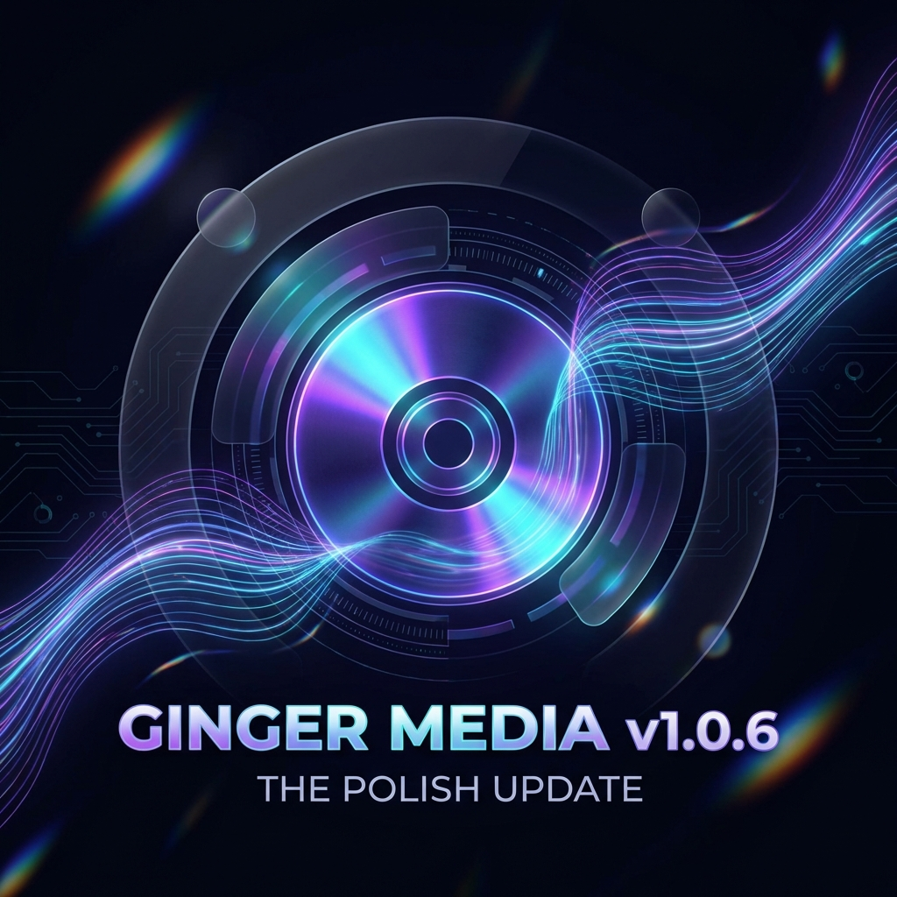

# 🚀 Ginger Media v1.0.6 - The Polish Update

Version 1.0.6 brings significant stability improvements, the highly-requested Standalone Image Gallery, and a unified branding experience.

## ✨ New Features

### 🖼️ Standalone Image Gallery
- **Independent Browsing**: Browse your photo collection without interrupting music or video playback.
- **Double View Mode**: Seamlessly switch between a high-performance **Grid** view and a detailed **List** view.
- **Immersive Previewer**: All-new full-screen image viewer with dedicated navigation (Left/Right) and slideshow mode.
- **Library Management**: Rename or remove images directly from the gallery interface (Grid & Large View).
- **Fast Thumbnails**: Optimized thumbnail generation for all formats, including animated GIFs.

### 🧘 Zen Mode
- **Zero-Distraction Viewing**: Toggle Zen Mode to hide all player controls and headers for a minimalist, immersive media experience.

### 🔌 Plugin Framework Foundations
- **UI Tab Registration**: Foundations for plugins to register their own navigation tabs.
- **Media Providers**: Initial support for external media provider browsing and searching.
- **Extended Settings**: Plugin-specific settings management integrated into the global settings view.

## 🛠️ Unified Branding
- **Official Logo**: The Ginger Media logo is now integrated into the **System Tray**, **Taskbar**, and **Toolbar**.
- **Cross-Platform Icons**: Automatic scaling for system tray icons to ensure compatibility with Linux, Windows, and macOS bars.

## 🐛 Bug Fixes & Refinements
- **Audio Extractor**: Resolved the "Invalid Argument" error by standardizing FFmpeg stream handling for audio-only exports.
- **Layout Integrity**: Fixed the obscured "Extract Audio" button by implementing a sticky footer and scrollable settings area.
- **Navigation Safety**: Hardened the gallery navigation to prevent "index out of bounds" errors during rapid browsing.
- **Engine Stability**: Improved stream cleanup when switching between different media types.

---
*Thank you for using Ginger Media. Your feedback keeps the experience moving forward!*
